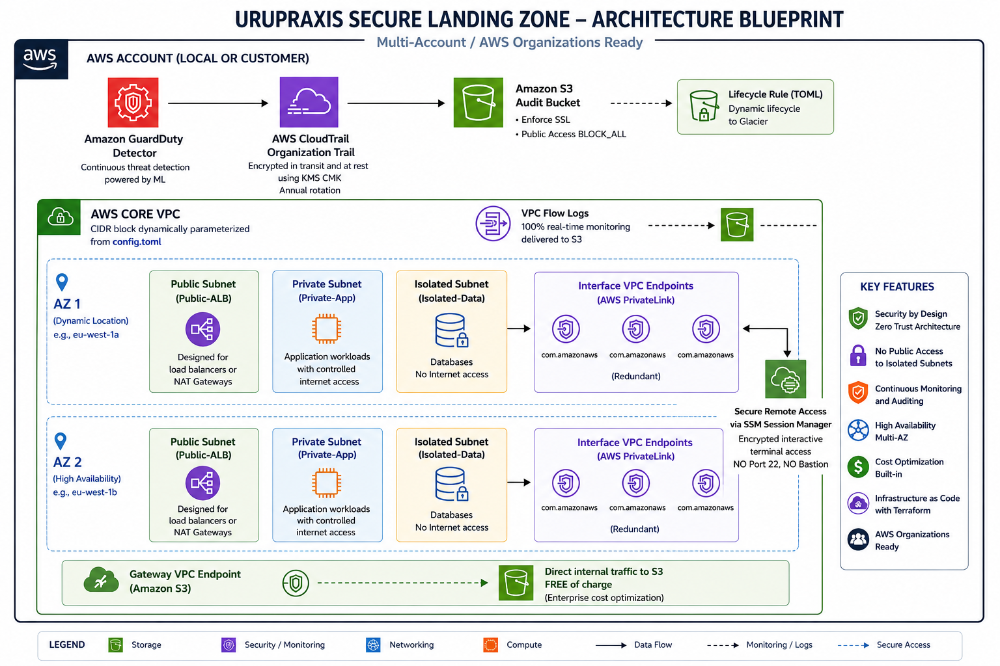

# AWS Secure Landing Zone Blueprint

A production-ready, highly compliant AWS Landing Zone baseline automated using **AWS CDK V2 (Python)**. This blueprint implements enterprise-grade infrastructure-as-code (IaC) governance, perimeter defense, and automated data security, following the **AWS Well-Architected Framework** and **PCI-DSS/ISO 27001** blueprints.

---

## 🏗️ Architecture Diagram



---

## 🏗️ Architecture Overview

The blueprint automates the instantiation of an isolated environment containing:
*   **Secure Core VPC**: Multi-AZ segmentated network topology utilizing Public, Private (NAT-egress), and Isolated (No-internet) layers with automated **VPC Flow Logs** routed to an encrypted S3 bucket.
*   **Perimeter & Session Isolation**: **AWS PrivateLink Interface Endpoints** deployed in isolated subnets for **AWS Systems Manager (SSM) Session Manager**, allowing complete secure remote ec2 fleet management without opening Inbound Port 22 or using Bastion Hosts.
*   **Enterprise Governance**: Region-wide **Amazon GuardDuty** autonomous threat detection and a full organization-ready **AWS CloudTrail Management Trail**.
*   **Data Security & KMS**: Customer Managed Key (CMK) implementation with **native annual rotation enabled** and custom resource policies enforcing least-privilege, multi-account delegation.
*   **S3 Hardening**: Log archival bucket featuring absolute public access blocking (`BLOCK_ALL`), **enforced SSL/TLS 1.2+ transport policies**, bucket versioning protection, and conditional **Amazon S3 Glacier** archival lifecycles driven by environment rules.

---

## ⚙️ Configuration Management (`config.toml`)

The repository uses a single, human-readable **TOML parameter engine** []. Environment properties scale dynamically without modifying the Python core codebase.

```toml
[dev]
account = "123456789012"
region = "eu-west-1"
vpc_cidr = "10.10.0.0/16"
availability_zones = ["eu-west-1a", "eu-west-1b"]
enable_strict_security = false

[prod]
account = "444455556666"
region = "eu-west-1"
vpc_cidr = "10.0.0.0/16"
availability_zones = ["eu-west-1a", "eu-west-1b", "eu-west-1c"]
enable_strict_security = true
```

---

## 🚀 Getting Started & Deployment

### 📋 Prerequisites

*   Node.js (v18+) & AWS CDK CLI updated (`npm install -g aws-cdk`) []
*   Python 3.10+ with active `virtualenv`
*   Configured AWS CLI credentials matching the target account environment (`aws configure`) []

### 🛠️ Local Installation

1. Clone the repository:
   ```bash
   git clone https://github.com
   cd urupraxis-secure-landing-zone
   ```

2. Initialize and activate the Python virtual environment:
   ```bash
   python3 -m venv .venv
   source .venv/bin/activate  # On Windows use: .venv\Scripts\activate
   ```

3. Install production dependencies and TOML engine modules:
   ```bash
   pip install -r requirements.txt
   ```

### 📈 Compilation & Synthesis

To evaluate the template output purely offline or check CloudFormation structural state without changing cloud state, inject the `CDK_ENV` modifier in-line:

```bash
# Synthesize the Development environment manifest
CDK_ENV=dev cdk synth

# Synthesize the Production environment manifest (activates S3 Glacier lifecycles and GuardDuty S3 protections)
CDK_ENV=prod cdk synth
```

### 🛰️ Infrastructure Deployment

Once your AWS target environment is properly bootstrapped (`cdk bootstrap`), roll out the stack in one unified execution:

```bash
CDK_ENV=dev cdk deploy
```

---

## 🛡️ Operational Security & Best Practices (OPSEC)

This architecture maintains strict segregation between infrastructure layers:
*   **Immutable Cryptography**: KMS keys adopt a `RETAIN` removal policy to guarantee that encrypted storage data never becomes unrecoverable due to accidental stack deletion [].
*   **Zero-Overhead Configuration**: Subnet masking and structural routing compute internally based on parameters, minimizing hardcoded human error vectors [].

---
**Maintained by UruPraxis Cloud Solutions** - *Secure Cloud Engineering & Automation Frameworks.*
